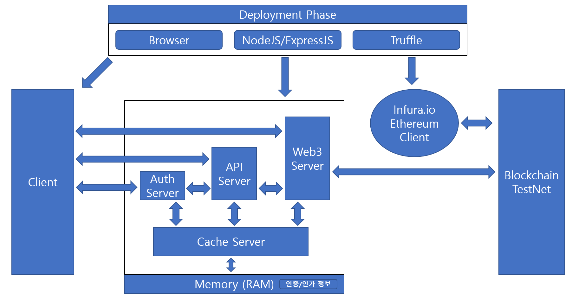

# Dev. Environment

 - `Ubuntu` 18.04
 - `Node.js` 16 version (`npm` 8 version)

<br><br><br><br><br>

# Getting Started

## - Cache Server

```bash
npm run start:cache
```

## - Auth Server

```bash
npm run start:auth
```

## - Api Server

```bash
npm run start:api
```

## - Client

 - see `client/` directory

 <br><br><br><br><br>

# High-Level Architecture

